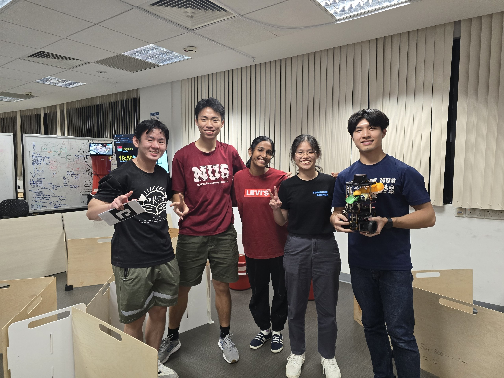

# TurtleBot3 Burger Spiral Slide V1.0 

## Mission Overview
In this year’s mission, we have to design, implement, and validate an Autonomous Mobile Robot (AMR) workflow inspired by modern warehouse intralogistics. 

## Navigation

- [User Guide to run laptop code](software_doc/pc_code/README.md)
- [User Guide to run rpi code](software_doc/rpi_code/README.md)
- [Requirements specifications](docs/Requirement_Specifications.md)
- [Con Ops](docs/Con_Ops.md)
- [Soft/firmware development documentation](docs/Software_Firmware_Development_Documentation.md)
- [Testing documentations](docs/Testing_Documentations.md)
- [Electrical module documentation](electrical_doc/electrical subsystem.md)
- [Mechanical module documentation](mech_doc/README.md)
- [Mechanical module files](mech_doc)

## Team

1) Chin Yan Xu (Software)
2) Chua Wei Jack (Software)
3) Layog Ethan Andrei Belo (Mechanical)
4) Tan Yun Qi (Software)
5) Viswanathan Sahanaa (Electrical)

## User Guide

1) Load payload one by one onto ball magazine ramp while ensuring the ball holders are in the down position
2) Follow instructions in [User Guide to run laptop code](software_doc/pc_code/README.md)
3) Follow instructions in [User Guide to run rpi code](software_doc/rpi_code/README.md)

## Technical Details

| Technical components | Details |
|---|---|
| Model name | TurtleBot3 Burger Spiral Slide V1.0 |
| Software version | 0.3.0 |
| Battery capacity| Lithium polymer 11.1V 1800mAh / 19.98Wh 5C |
| Max Runtime | ~ 1 - 1.5 hours|
| Charging time| ~ 2.5 hours |
| Weight | 1.26 kilograms |
| Purpose | To explore and map a maze autonomously and dispense 3 ping pong balls each to a moving receptacle and a stationary receptacle.  |

## Subcomponents

1x Turtlebot 

Payload Delivery:
    2x OV5648 5MP Arducam
    2x Camera Mount
    2x Ball Gates
    1x Ball Magazine Ramp
    1x Ball Holder
    1x Ball Launch Ramp
    2x SG90 Servo Motor
    2x Servo Motor Stand

## Referenced repositories

| Purpose | Package name/ link |
|---|---|
|ArUco tag detection|https://github.com/JMU-ROBOTICS-VIVA/ros2_aruco|
|Navigation and docking|https://github.com/ros-navigation/navigation2|
|Frontier detection|https://github.com/SeanReg/nav2_wavefront_frontier_exploration|
|Servo control|https://github.com/sarnold/RPi.GPIO|
