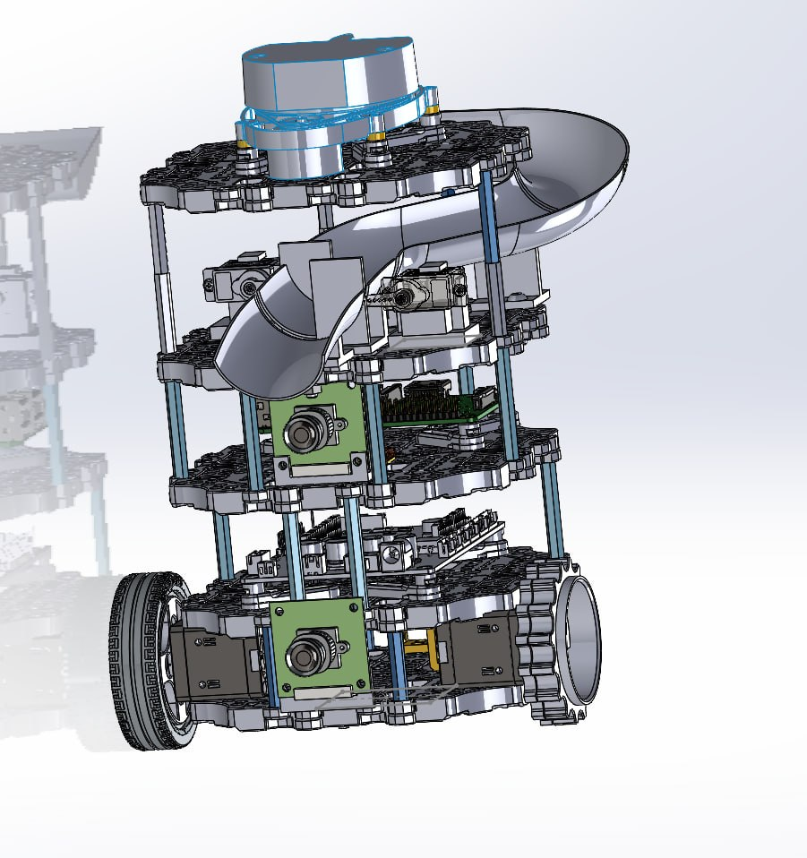
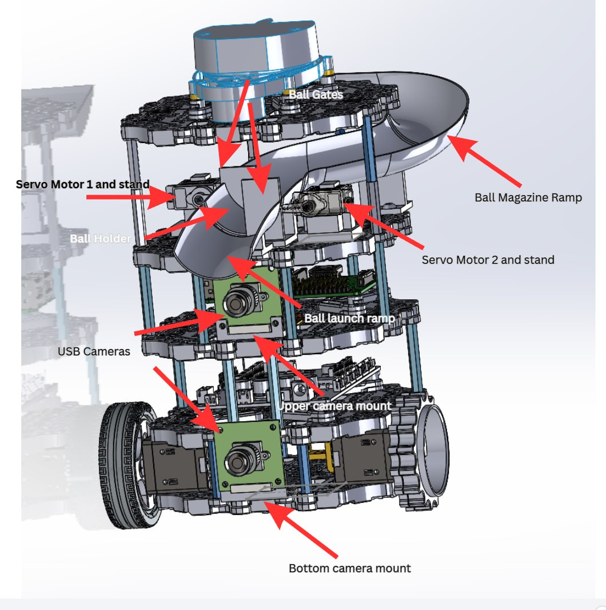

# Concept of Operations

## Navigation

- [Back to main README.md](../README.md)

## Concept of Operation and High-Level Design

Shooting the payload into the receptacle comes with much uncertainties and complexities. Any deviation in the force used to shoot the payload can cause it to go wildly off trajectory. To avoid these issues, we decided our robot should deliver the payload by moving close to the receptacle and then releasing the payload into the receptacle. The payload will be guided by a ramp into the receptacle. Below is an illustration of the turtlebot with the payload delivery system.

To enable our robot to detect the locations of the receptacle, we marked the receptacles using ArUco tags. The stationary receptacle is marked with only one ArUco tag while the moving receptacle is marked with two, one at the bottom of the receptacle the other is inside the receptacle. This configuration enable the turtlebot to detect and dock at each receptable and for the case of the moving receptacle, wait for the moving receptacle's inner ArUco tag to be visible before dispensing the payload. 

While our design requires the turtlebot to dock right beside the receptacles, it significantly reduces the likelihood of missing.

## Subsystem Design

To achieve the objectives and the concept of operation, we divided our high level design into 2 subsystems: the navigation and payload delivery subsystems.

### 1. Payload Delivery

The main componenent of the payload delivery subsystem is the Ball Magazine Ramp. Its main purpose is to hold the payload and utilises gravitational potential energy to eject the payload into the receptacle. It is angled downwards so that the payload will naturally roll down the ramp and into the receptacle. To prevent the payload from being released prematurely, two servos with panels called ball gates act as gates to control the flow of the payload. Upon being activated, the servo will go into the open then close position according to a given timing. The ball holder holds the next ball to be released and the ball launch ramp guides the payload into the receptacle. Two cameras, one mounted on the lowest level of the turtlebot and the other mounted on the third level of the turtlebot, are used to detect the ArUco tags. The lower camera is used to find the location of the receptacle while the top camera is used to detect whether the moving receptacle is in sight before releasing the payload.

### 2. Navigation

The navigation subsystem is responsible for moving the robot safely and accurately from its current position to the target receptacle. The Dynamixel motors provide the motive force for the robot, while the OpenCR handles low-level motor control and interfaces with the Raspberry Pi. The LiDAR is used to scan the surroundings and provide environmental information for localisation, mapping, and obstacle detection.

At the start of operation, the robot uses LiDAR-based SLAM to build or update a map of the environment. The map is used to find frontiers using a frontier detection algorithm adapted from adapted from https://github.com/SeanReg/nav2_wavefront_frontier_exploration. The turtlebot would navigate to the chosen frontier to explore the maze.

When the robot detects the ArUco tag of a receptacle, the navigation subsystem transitions from general path navigation to docking. At this stage, the cameras are used together with ArUco tag detection to refine the robot's alignment relative to the receptacle. The robot then performs a docking manoeuvre using the NAV2 docking framework so that the payload delivery subsystem can release the payload from a close and controlled position.

For the moving receptacle, the navigation subsystem brings the robot to a waiting position near the receptacle's path and maintains an appropriate pose for visual tracking. Once the required ArUco marker becomes visible and the receptacle is in a suitable position, the robot can proceed with the payload release operation.