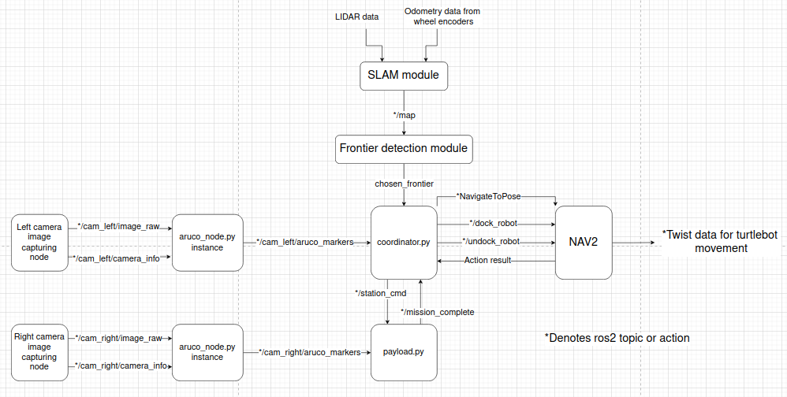
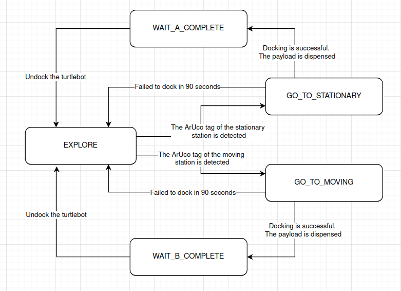

# Soft/Firmware Development Documentation

## Navigation

- [Back to main README.md](../README.md)

## Software Interfaces

The software architecture is organised around the `coordinator.py` node, which serves as the main decision-making module for exploration, docking, and payload delivery. The SLAM module receives LiDAR data and wheel-encoder odometry to construct an occupancy grid map, which is then used by the frontier detection module to identify candidate exploration goals. The selected frontier goal is passed to the coordinator, which decides whether the robot should continue exploring or transition to a docking task.

The left camera image stream is processed by an ArUco detection node, which publishes `/cam_left/aruco_markers` to the coordinator. The coordinator uses these detections to identify the stationary and midpoint tags and to determine when to stop exploration and begin docking. Once a target is detected, the coordinator interacts with Nav2 through the `NavigateToPose`, `dock_robot`, and `undock_robot` action interfaces to move the robot and align it with the receptacle.

The coordinator also communicates with the payload delivery module through a command-and-status interface. It publishes `/station_cmd` to trigger payload release for either Station A or Station B, while `payload.py` publishes `/mission_complete` back to the coordinator after the dispensing sequence is complete. This allows the coordinator to resume exploration only after the payload task has finished and the robot has undocked.

For the moving-station mission, the right camera image stream is processed by a separate ArUco detection node that publishes `/cam_right/aruco_markers` to `payload.py`. After the coordinator arms the Station B sequence, the payload node waits for the appropriate visual trigger before actuating the servos. This ensures that payload release occurs only when the moving target is in the correct position.

## Frontier Detection 
The frontier detection module enables the robot to autonomously explore unknown areas of the maze using the occupancy grid map. A cell is considered a frontier if it is a free cell and at least one of its neighbours is unknown. The frontier detection module groups neighbouring frontier cells into frontier regions and chooses the centroid of a region as the navigation destination for the region. The centroid of the largest frontier region is chosen as the navigation goal. Previously the nearest region is chosen but this would cause the robot to only explore a small area in the maze. If a suitable frontier region is not found, the modules selects a fallback destination by choosing a free-space point near the explored unexplored boundary that is sufficiently far from obstacles and recently visited fallback points. 

## Coordinator
The coordinator orchestrates the overall mission logic, including maze exploration, docking, payload delivery triggering, and undocking. Actual navigation is handled by the Nav2 `NavigateToPose` action, while docking and undocking are handled using the Nav2 docking actions. When the robot is in the `EXPLORE` state, it uses frontier detection to search the maze. If the stationary or moving station ArUco tag is detected, the coordinator transitions to the corresponding docking state. Once docking succeeds, the coordinator triggers payload delivery and waits for the payload node to report completion before commanding the robot to undock and resume exploration.

| State | Function |
|---|---|
| EXPLORE | The robot explores the maze using frontier detection. |
| GO_TO_STATIONARY | The robot has detected the ArUco tag of the stationary station and is attempting to dock to it. |
| GO_TO_MIDPOINT | The robot has detected the ArUco tag associated with the moving-station mission and is attempting to dock. |
| WAIT_A_COMPLETE | The robot has triggered payload delivery for Station A and is waiting for the payload sequence to finish. |
| WAIT_B_COMPLETE | The robot has triggered payload delivery for Station B and is waiting for the payload sequence to finish. |

## Servo Code
The `payload.py` program controls the two servos used for payload release. It subscribes to `/station_cmd` for mission commands and publishes `/mission_complete` when dispensing is done. For Station A, the payload sequence is executed immediately after receiving `START_A`. For Station B, the node is first armed by `START_B`, and payload release is then triggered step-by-step based on ArUco detections from the right camera. This allows the moving station payload to be dispensed only when the target is in the correct position.

