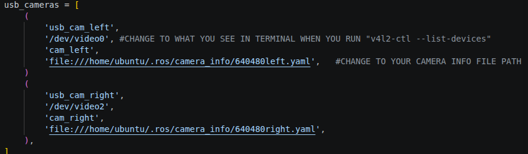

# RPI LAUNCH STACK

### before getting started you should make sure that you have followed the setup guide for your rpi in the [turtlebot setup guide](https://emanual.robotis.com/docs/en/platform/turtlebot3/sbc_setup/#sbc-setup)

#### please note that for the rpi camera setup, follow the v4l2 instructions

additionally, for image nodes for usb cameras

> sudo apt-get install ros-humble-usb-cam v4l-utils


### this repository includes the launch files for:
 - #### Camera Image Node
 - #### Aruco Detection Node
 - #### Camera to baselink tf static transform files


<br></br>
## setup [ON RPI]
```bash
1. mkdir launchfiles && cd launchfiles
2. git clone --branch rpi_code --single-branch https://github.com/ChinYanXu/CDE2310_g4_AY2526_turtlebot_ROS2.git
3. rosdep update
4. rosdep install --from-paths src --ignore-src -r -y
5. pip3 install opencv-contrib-python transforms3d
6. colcon build
7. source install/setup.bash
8. chmod +x one.sh

9. cd ~/launchfiles/camera_calibration_files
10. cp * ~/.ros/camera-info
```
###### check that numpy version is 1.26.4, 

> python3 -c "import numpy; print(numpy.__version__)"

###### if it isnt, install numpy version 1.26.4
```
pip uninstall numpy -y
pip install numpy==1.26.4
```

### camera calibration
#### You should follow [this guide](https://docs.ros.org/en/kilted/p/camera_calibration/doc/tutorial_mono.html) to obtain your camera calibration files
launch camera image nodes 
```
#list all camera devices and remember it
1. v4l2-ctl --list-devices
#edit launch file parameters
nano cam_launch.py    #->change the camera directories in lines 10 and 16 
nano camult.py        #->change the camera directories in lines 48 and 54
```



#### move camera calibration files to correct destination
```
1. cp <where your camera calibration .yaml files are at>/* ~/.ros/camera_info
```
###### **_do take note that the camera resolution during operation and calibration has to be the same_**

<br></br>

## launch all files
```
1. cd ~/launchfiles
2. ./one.sh rpi
```